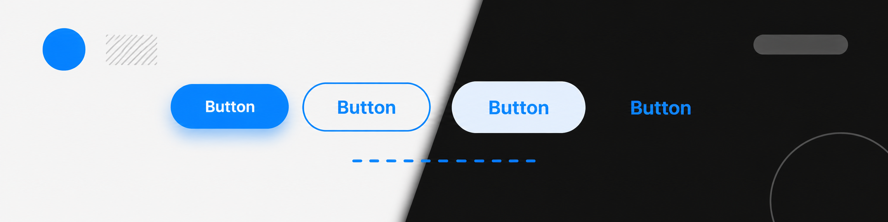

# XAUI

Composition-first UI components for React Native and the web. Expo, Reanimated, one theme.

[](https://www.npmjs.com/package/@xaui/native)
[](./LICENSE)
[](https://github.com/rygrams/xaui)



```bash
npm i @xaui/native
npm i @xaui/hybrid # hybrid mobile app, through react-native-web
```

[Docs](https://ui.xtartapp.com/?utm_source=github&utm_medium=referral&utm_campaign=evergreen&utm_content=readme) · [Getting started](https://ui.xtartapp.com/docs/getting-started?utm_source=github&utm_medium=referral&utm_campaign=evergreen&utm_content=readme) · [Components](https://ui.xtartapp.com/docs/components?utm_source=github&utm_medium=referral&utm_campaign=evergreen&utm_content=readme)

## Quick start

Install the native peers. On Expo, let Expo pick their versions:

```bash
npx expo install react-native-reanimated react-native-worklets react-native-gesture-handler react-native-svg react-native-safe-area-context
```

Mount the provider once, at the root of the app:

```tsx
import { GestureHandlerRootView } from 'react-native-gesture-handler'
import { XAUIProvider } from '@xaui/native/theme'

export default function App() {
  return (
    <GestureHandlerRootView style={{ flex: 1 }}>
      <XAUIProvider colorMode="system">
        <YourApp />
      </XAUIProvider>
    </GestureHandlerRootView>
  )
}
```

Import each component from its own path and compose it from slots:

```tsx
import { Button } from '@xaui/native/button'

export function SaveButton() {
  return (
    <Button variant="primary" onPress={save}>
      <Button.Icon as={SaveIcon} />
      <Button.Label>Save</Button.Label>
    </Button>
  )
}
```

React Native CLI setup, the Babel plugin and the optional peers are covered in the [installation guide][installation].

## Components

70+ components, each documented with a live preview and its props:

- **Actions** — Button, Fab, MorphButton, SlideButton, ToggleButton
- **Forms** — TextField, Select, Combobox, DatePicker, TimePicker, PhoneNumberField, InputOTP, Slider, Switch, and 17 more
- **Data display** — Avatar, Badge, Chip, List, Table, Timeline, Carousel, Widget
- **Feedback** — Alert, Toast, Snackbar, Skeleton, ProgressBar, Spinner
- **Overlays** — Dialog, BottomSheet, Menu, Popover
- **Navigation** — Tabs, Accordion, Stepper, Pager, Calendar
- **Charts** — Area, Bar, Line, Pie, Radar and Radial charts
- **Layout** — Card, Surface, Scaffold, Divider, Row, Column, Stack, Grid

[Browse all components →][components]

## Theming

One theme drives every component. Give it your brand colours; the soft, pressed and contrast shades are derived for light and dark mode.

```ts
import { createTheme } from '@xaui/native/theme'

export const appTheme = createTheme({
  colors: {
    light: { accent: '#2563EB', accentForeground: '#FFFFFF' },
    dark: { accent: '#60A5FA', accentForeground: '#0F172A' },
  },
  radius: 16,
})
```

Pass it to `<XAUIProvider theme={appTheme}>`. The [theme guide][theme] lists every token.

## On the web

`@xaui/hybrid` renders the same components in the browser through `react-native-web`: same props, same slots, same theme. Your bundler aliases `react-native` to `react-native-web`; [HYBRID-SETUP.md](./HYBRID-SETUP.md) has the config for Next.js and Vite.

## Coding with an AI agent

Install the XAUI skill so your agent reads the real API instead of guessing it:

```bash
npx skills add https://ui.xtartapp.com/skills/xaui/SKILL.md
```

The docs also publish an [llms.txt][llms] and a Markdown version of every component page.

## Upgrading from 0.2.x

Version 0.9 is a new API. The previous components are still available, frozen, as `@xaui/native-legacy@0.2.11`, and both packages can run side by side while you move screen by screen. The [migration guide][migration] maps the old props to the new ones.

## Contributing

XAUI is a pnpm + Turborepo monorepo:

| Path                     | What it is                                   |
| ------------------------ | -------------------------------------------- |
| `packages/native`        | `@xaui/native` — components, theme, provider |
| `packages/hybrid`        | `@xaui/hybrid` — the web build               |
| `packages/native-legacy` | `@xaui/native-legacy` — the frozen 0.2.x API |
| `apps/demo`              | Expo app with a screen per component         |
| `apps/docs`              | The documentation site                       |

```bash
pnpm install
pnpm dev
pnpm test
```

Read [CONTRIBUTING.md](./CONTRIBUTING.md) before opening a pull request. Issues labelled [good first issue](https://github.com/rygrams/xaui/labels/good%20first%20issue) are a good place to start.

## License

[MIT](./LICENSE)

[installation]: https://ui.xtartapp.com/docs/installation?utm_source=github&utm_medium=referral&utm_campaign=evergreen&utm_content=readme
[components]: https://ui.xtartapp.com/docs/components?utm_source=github&utm_medium=referral&utm_campaign=evergreen&utm_content=readme
[theme]: https://ui.xtartapp.com/docs/theme?utm_source=github&utm_medium=referral&utm_campaign=evergreen&utm_content=readme
[llms]: https://ui.xtartapp.com/docs/llms-txt?utm_source=github&utm_medium=referral&utm_campaign=evergreen&utm_content=readme
[migration]: https://ui.xtartapp.com/docs/migration?utm_source=github&utm_medium=referral&utm_campaign=evergreen&utm_content=readme
